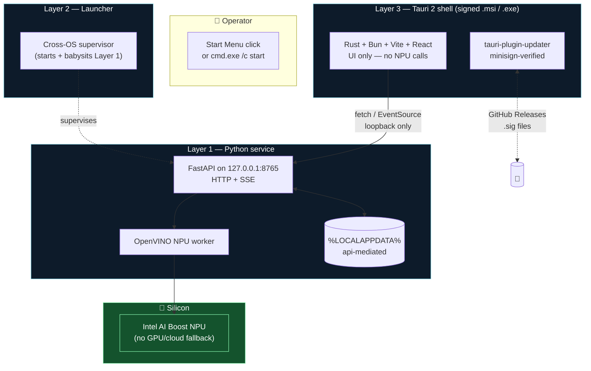

<div align="center">

# aeo-npui

**An NPU‑first local LLM operator — same app, same keystrokes, Windows or WSL.**

No GPU fallback. No cloud fallback. Your silicon, your model, your prompt, your machine.

[](./LICENSE)
[](./VERSION)
[](./docs/profiles/intel-core-ultra-win11-wsl.md)
[](./docs/roadmap/)
[](./CLAUDE.md#type-checking-rule-the-only-type-checker-is-ty)

<picture>
  <source media="(prefers-color-scheme: dark)" srcset="./docs/assets/screenshots/hero-desktop-windows.png">
  
</picture>

<sub>📸 screenshots land on first dev-loop capture — see
<a href="./docs/assets/screenshots/README.md">docs/assets/screenshots/</a></sub>

</div>

---

## 30‑second pitch

Consumer laptops now ship with an **NPU** — an on‑die neural accelerator
distinct from the GPU. It sits idle for most users because the tooling
points at cloud APIs or CUDA. `aeo-npui` is a two‑piece, signed, auto‑
updating desktop app that makes the NPU the **only** inference target,
and makes it feel the same whether you double‑click an installer on
Windows or `cmd.exe /c start` it from a WSL shell.

- **Layer 1 — service:** a Python FastAPI + SSE process on
  `127.0.0.1:8765`, owning the OpenVINO NPU worker and all storage.
- **Layer 3 — desktop:** a Tauri 2 shell (Rust + Bun + Vite + React) that
  is *only* an HTTP+SSE client. No Node-in-prod, no Electron, no IPC into
  hardware.
- **Layer 2 — launcher:** a sliver of glue that starts and supervises
  Layer 1 identically from either OS entry point.

---

## Why you might care

<table>
<tr>
<td width="50%">

### 🔧 the hobbyist
> *"Can I actually use the NPU on my laptop?"*

Yes. Install the MSI, open the app, the status dot turns green, and you
are talking to a model running on silicon that costs nothing to run and
never leaves your machine. There is no Docker, no CUDA toolkit, no API
key, no `pip install` dance to perform.

</td>
<td width="50%">

### 👩‍💻 the developer
> *"I want to ship a cross‑OS NPU app without the usual tire fire."*

Every boundary in this repo is explicit: `>=` in manifests, locks are
the source of truth, `ty` is the only Python checker, `tsc` is the only
TS checker, `make ci` is the only CI. Tauri 2, not Electron. Signed
updater built in. One `make ci` on WSL produces **both** the Linux
`cargo build` artifacts *and* the Windows NSIS + MSI bundles.

</td>
</tr>
<tr>
<td width="50%">

### 🧭 the operator
> *"I need to run this on other people's laptops."*

The MSI is per‑user (no admin elevation), installs to
`%LOCALAPPDATA%\aeo-npui\`, self‑updates via minisign‑signed updater
artifacts, and the service listens only on loopback. Storage lives under
`%LOCALAPPDATA%` mediated by the service (ADR‑010), so config and model
caches are inspectable without reverse‑engineering IPC. Launch parity —
Windows Start Menu **or** `cmd.exe /c start` from WSL — is a test
invariant, not a promise.

</td>
<td width="50%">

### 🎯 the product engineer
> *"Show me the invariants, not the feature list."*

Four invariants drive every decision (see
[`docs/intent.md`](./docs/intent.md)):
1. **NPU‑only** — GPU and cloud fallback are out of scope.
2. **UI is service client only** — no NPU calls from the shell
   ([ADR‑002](./docs/decisions/ADR-002-ui-is-service-client-only.md)).
3. **Identical UX across launch paths**
   ([ADR‑003](./docs/decisions/ADR-003-identical-ux-across-launch.md)).
4. **Storage is API‑mediated**
   ([ADR‑010](./docs/decisions/ADR-010-storage-localappdata-api-mediated.md)).

11 ADRs under [`docs/decisions/`](./docs/decisions/) show the reasoning
and the roads not taken.

</td>
</tr>
</table>

---

## Architecture at a glance



The **only** wire between layers is HTTP+SSE on loopback — documented
in [`docs/contracts/service-api.md`](./docs/contracts/service-api.md).
That contract is what survives a Layer‑1 rewrite or a Layer‑3 rewrite;
everything else is implementation.

---

## Quick start

The repo targets Intel Core Ultra class laptops with an on‑die NPU,
running Windows 11 with WSL2. Older hardware and other distros aren't
*blocked*, but they aren't what 0.1.x aims for — see
[`docs/profiles/intel-core-ultra-win11-wsl.md`](./docs/profiles/intel-core-ultra-win11-wsl.md).

### 🪟 Windows user

<details open>
<summary><b>Fastest path — install and run</b></summary>

1. Grab the latest `aeo-npui_<ver>_x64-setup.exe` (NSIS) or
   `aeo-npui_<ver>_x64_en-US.msi` from the releases page.
2. Double‑click. NSIS installs per‑user into `%LOCALAPPDATA%\aeo-npui\`;
   no admin elevation.
3. Launch from the Start Menu. The service starts automatically in the
   background and the in‑app health dot turns green.

</details>

<details>
<summary><b>Build from source (PowerShell)</b></summary>

```powershell
git clone https://github.com/AeyeOps/aeo-npui.git
cd aeo-npui
.\bootstrap\bootstrap.ps1           # VS BuildTools, WebView2, Rust, Bun
bun install --frozen-lockfile
cd desktop
bun run tauri build                 # → src-tauri/target/release/bundle/
```

First `bootstrap.ps1` run may pop a UAC dialog for the Visual Studio
BuildTools installer — that's the only interactive prompt. Subsequent
runs are silent and idempotent.

</details>

### 🐧 Linux / WSL user

<details open>
<summary><b>Fastest path — the one‑command build</b></summary>

```bash
git clone https://github.com/AeyeOps/aeo-npui.git
cd aeo-npui
make bootstrap                       # apt + (on WSL) also pwsh.exe winget
uv sync && bun install
make ci                              # service + desktop + Windows bundles on WSL
scripts/launch-dev.sh                # service + tauri dev in parallel
```

On **WSL**, `make bootstrap` installs both halves — Linux `webkit2gtk`
etc. via `apt`, and MSVC BuildTools / WebView2 / Rust / Bun on the
Windows side via `winget`. `make ci` likewise builds **both** the Linux
`cargo --locked` gate *and* the Windows NSIS + MSI installers in one
process. No alternating hosts, no "now switch to PowerShell" moments.

</details>

<details>
<summary><b>Individual make targets</b></summary>

| Command | What it does |
|---|---|
| `make bootstrap` | OS‑level deps from `bootstrap/<os>.txt` (one‑time) |
| `make service` | `uv sync --frozen && ruff + ty + pytest` |
| `make desktop` | `bun install --frozen-lockfile && tsc --noEmit && cargo build --locked` |
| `make build-windows` | NSIS + MSI bundles only (WSL→Windows staging) |
| `make ci` | Everything above + lock & checker‑purity & version gates |
| `make version-check` | Fail if any manifest drifts from `VERSION` |
| `make version-sync` | Push `VERSION` into every manifest |

</details>

---

## Versioning — one place, one line

The canonical version lives at the repo root in
[`VERSION`](./VERSION) — a single line, `0.1.0` today. Every shipping
manifest pulls from it:

```
                ┌─────────────────────────────┐
                │  VERSION   ← edit this file │
                └──────────────┬──────────────┘
                               │
         ┌─────────────────────┼─────────────────────┐
         ▼                     ▼                     ▼
  package.json          Cargo.toml            pyproject.toml
  desktop/package.json  tauri.conf.json       (service)
```

Bumping:

```bash
scripts/version.py bump 0.2.0        # writes VERSION, syncs all manifests
# or
echo 0.2.0 > VERSION && make version-sync
```

CI fails the build if any manifest drifts (`make version-check` is in
the `ci` chain). `console-native/` is frozen at its retired version
(superseded by [ADR‑004](./docs/decisions/ADR-004-native-shell-is-tauri-2.md))
and deliberately not synced.

---

## What's inside

```
.
├── VERSION                         ← canonical version (0.1.0)
├── CHANGELOG.md                    ← Keep‑a‑Changelog
├── LICENSE                         ← Apache‑2.0
├── Makefile                        ← the only CI; `make ci` is the gate
├── bootstrap/                      ← OS‑native prerequisites
│   ├── apt.txt / brew.txt / winget.txt
│   └── bootstrap.{sh,ps1}          ← idempotent dispatchers
├── service/                        ← Layer 1 — Python + FastAPI + SSE
│   └── src/npu_service/            ← web_api.py, cli.py, core/, ui/
├── desktop/                        ← Layer 3 — Tauri 2 shell
│   ├── src/                        ← React + Vite frontend
│   └── src-tauri/                  ← Rust crate + tauri.conf.json
├── scripts/
│   ├── launch-dev.sh               ← service + tauri dev, in parallel
│   ├── build-windows.ps1           ← runs inside VS Dev Shell
│   ├── make-windows.sh             ← WSL→Windows staging + build driver
│   ├── winlaunch.sh                ← WSL‑origin app launch (cd %TEMP% trick)
│   └── version.py                  ← VERSION single‑source enforcer
└── docs/
    ├── intent.md                   ← north star + 4 invariants
    ├── architecture.md             ← layer model
    ├── decisions/                  ← 11 ADRs
    ├── contracts/                  ← service‑api, events, metrics, endurance
    ├── profiles/                   ← target hardware profile
    └── roadmap/                    ← iteration plan + tasks.yaml
```

---

## Conventions

- **One package manager per layer.** `uv` (Python), `bun` (JS), `cargo`
  (Rust). No `npm`, `pip`, or `yarn`.
- **Manifests carry `>=`; lockfiles pin.** CI installs frozen
  (`uv sync --frozen`, `bun install --frozen-lockfile`,
  `cargo build --locked`).
- **Python is 3.13, Apache `ty` is the only checker.** `mypy`,
  `pyright`, `pytype`, and `pylance` are banned by
  `make checker-purity`.
- **TypeScript is `tsc` only.** Same reason, same discipline.
- **Public repo from day 1** so the SignPath Foundation OSS signing
  path stays open ([ADR‑007](./docs/decisions/ADR-007-signing-signpath-foundation.md)).

See [`AGENTS.md`](./AGENTS.md) for automation conventions and
[`CLAUDE.md`](./CLAUDE.md) for the Claude Code playbook.

---

## Status & roadmap

| Iteration | Scope | State |
|---|---|---|
| 1 | Service extracted from `aeo-infra/npu/`; CI gates green | ✅ shipped in 0.1.0 |
| 2 | Tauri 2 scaffold; `/health` wired; launch parity verified | ✅ shipped in 0.1.0 |
| 3 | Port screens from retired Expo tree to React DOM; Playwright via tauri‑driver | 🛠️ planned |
| 4 | Service API end‑to‑end; TUI retirement; Pydantic→TS codegen | 🛠️ planned |
| 5 | Signed release pipeline (SignPath); GitHub Releases auto‑updater | 🛠️ planned |

See [`docs/roadmap/`](./docs/roadmap/) for the unfiltered backlog.

---

## Contact

Questions, issues, and installer trouble →
[github.com/AeyeOps/aeo-npui/issues](https://github.com/AeyeOps/aeo-npui/issues).
For anything that doesn't belong in a public issue, reach **AeyeOps** at
[support@aeyeops.com](mailto:support@aeyeops.com).

## License & credits

Copyright 2026 **AeyeOps** — released under the
[Apache License, Version 2.0](./LICENSE). The Apache patent‑grant clause
is why we chose it over MIT.

The Layer‑1 service started as `AeyeOps/aeo-infra/npu/`; history was
preserved during extraction and then squashed at 0.1.0 to scrub real
developer‑machine identifiers from test fixtures (see
[`CHANGELOG.md`](./CHANGELOG.md) → *Security / Privacy*).

Built on the shoulders of **Tauri 2**, **OpenVINO**, **FastAPI**,
**Vite**, **Bun**, **uv**, **ty**, and the Intel NPU driver team's
public documentation.
